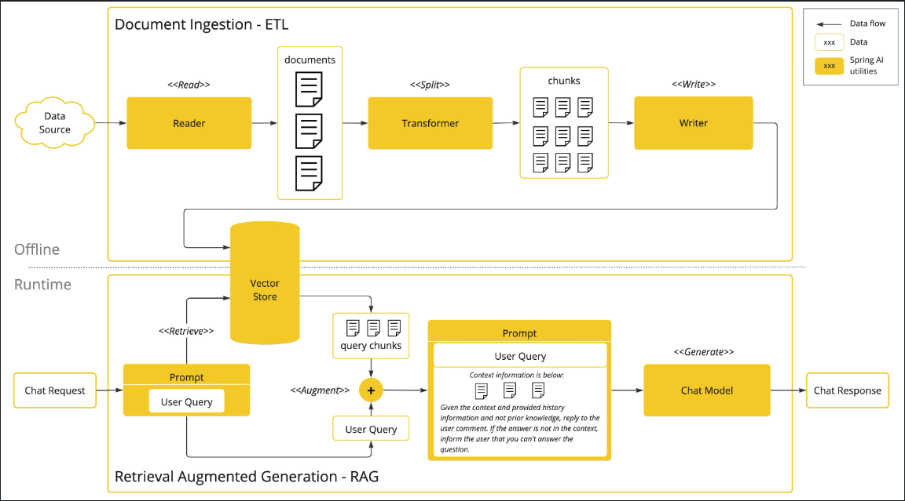
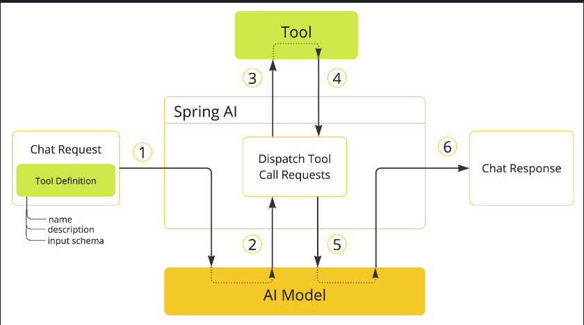

# RAG
***
> Below is the image of RAG pipeline flow bassically a ETL

***
## Tool Calling
LLM models are frozen after training, They are unable to access/modify the external data.
Tool calling mechanism addresses these shortcomings

1. When we want to make a tool available to the model, we include its definition in the chat request. Each tool definition comprises of a name, a description, and the schema of the input parameters.

2. When the model decides to call a tool, it sends a response with the tool name and the input parameters modeled after the defined schema.

3. The application is responsible for using the tool name to identify and execute the tool with the provided input parameters.

4. The result of the tool call is processed by the application.

5. The application sends the tool call result back to the model.

6. The model generates the final response using the tool call result as additional context
***
## Evaluating AI responses

In this step we will check the accuracy and the usefulness of the AI responses.