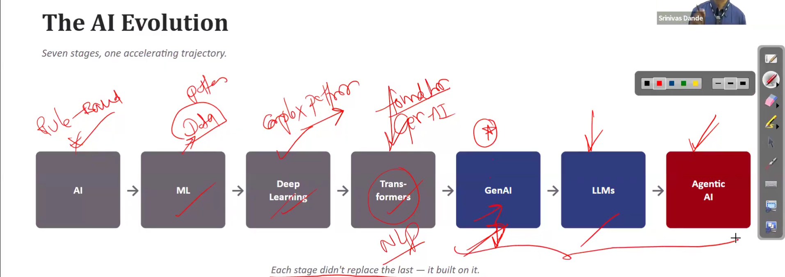
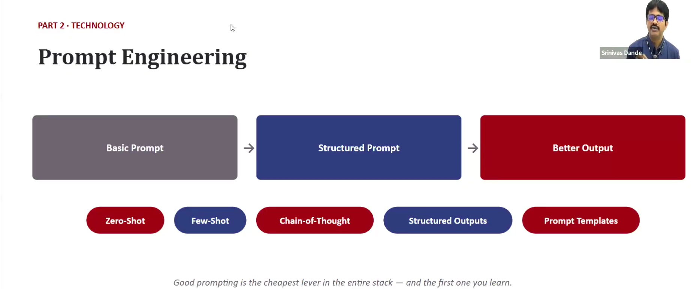
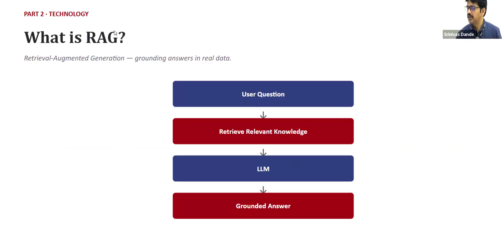
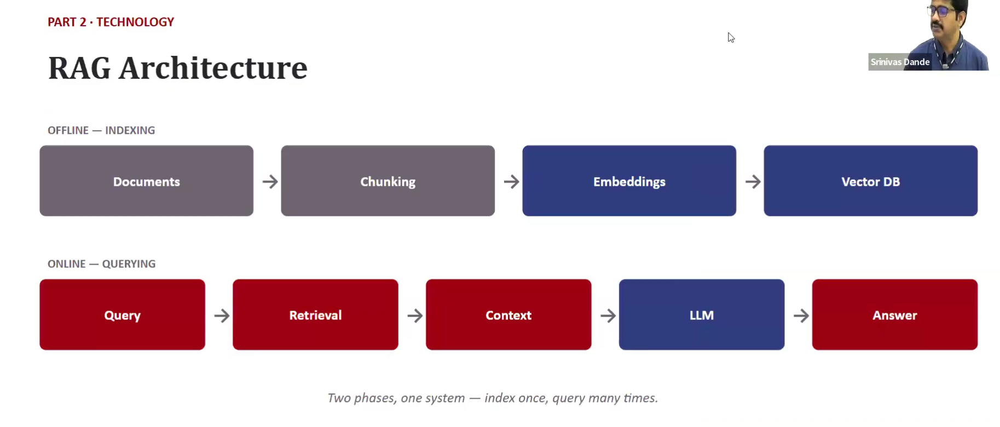

# Evolution of AI
***

In above image we saw the evolution of AI. How it moved from one face to another.
1. AI - We moved from rule based to pattern based 
2. Machine Learning - Here start understand the pattern in the data
3. Deep Learning - Understanding the complex pattern in the data
4. Transformer - Transforming text from one type to another
5. GenAI - Generating new text based on the data
6. LLM - Large Language Model
7. Agentic AI - We will give a task to the model he will find out the agents that will solve the task

### One is build on the previous evolution

***
# Prompt Engineering

### AI Agents
    AI agents can perform the goals like if we want to book a flight from Delhi to chandigarh
    We will define a goal for the agent it will search for all the flights and show you and then 
    ask for the confimation before booking then book the flight.