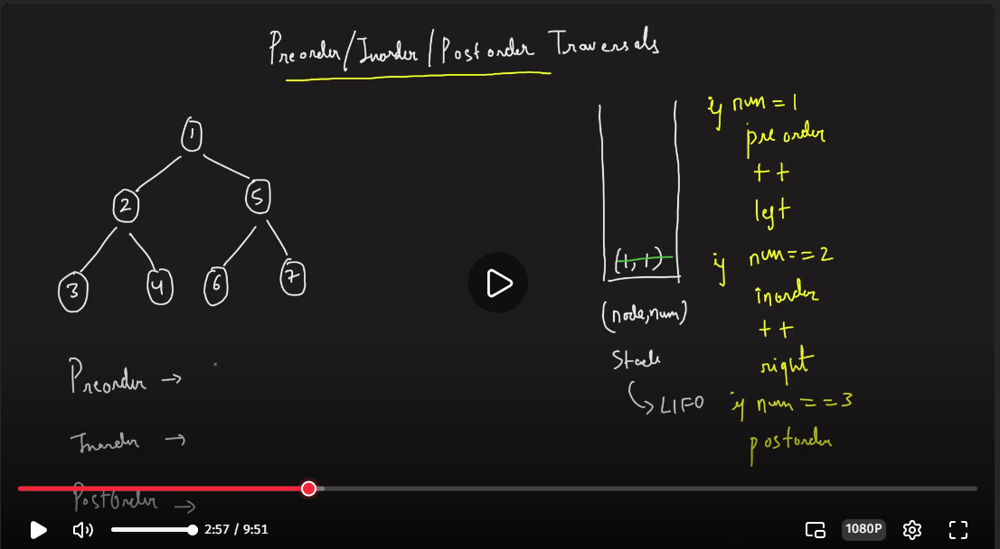

# Binary tree traversal:

BFS : Breadth First Search 
DFS:  Depth First Search

<pre>
      1
     / \
    2   3
   / \ / \
  4  5 6  7
</pre>

Inorder traversal (Left Root Right): 4 2 5 1 6 3 7

Pre-order Traversal(Root Left Right): 1 2 4 5 3 6 7

Post Order Traversal(Left Right Root): 4 5 2 6 7 3 1
***
To remember naming:
**In-order(In) meaning root will be between** 

**Pre-order(pre) Meaning root will be first element**

**Post-order(Post) : Root will be at last**

### BFS 
- In this we traverse element level vise bfs for above is: 1 2 3 4 5 6 7

# Post Order Traversal
In Post order we first traverse left - right - root
~~~java
void postOrder(Node root, List<Inter> list) {
    if (root == null) return;
    postOrder(root.left, list);
    postOrder(root.right, list);
    list.add(root.data);
}
~~~
***
# Post Order Traversal using Stack 
***
we will use stack for post order instead of recursion

1. We need to traverse element Left Right Root
2. In Stack order is LIFO, so to get this we need reverse order Root Right Left
3. We access the root, then we need to access right then Left
4. After root if we want to access Right we need to store it at last, So left will be put after root then right
5. After doing all this as we are accessing root fist then right then left, we need to reverse it

***
# Pre-order/In-order/Post-order In one go
We need to do all three order using single stack in one go

~~~java

void traverse(Node root) {
    // create 3 lists 
    var preOrder, inorder, postOrder = new ArrayList<>();
    var st = new Stack<Map.Entry<Integer, Integer>>();
    st.push(new Map.Entry<>(root.data, 1));
    while (!st.isEmpty()) {
        if (root.value == 1) {
            preOrder.add(root.key);
            root.value++;
            if(root.key.left != null)
                st.push(Entry(root.key.left, 1));
        } if(root.val == 2) {
            inorder.add(root.key);
            root.value++;
            if(root.key.right != null)
                st.push(Entry(root.key.right, 1));
        } if(roo.val == 3) {
            postOrder.add(root.key);
            st.pop();
        }
    }
}
~~~
[Striver video link](https://takeuforward.org/plus/dsa/problems/pre,-post,-inorder-in-one-traversal?source=strivers-a2z-dsa-track&tab=editorial)

You need to try run on the notebook to understand this logic

