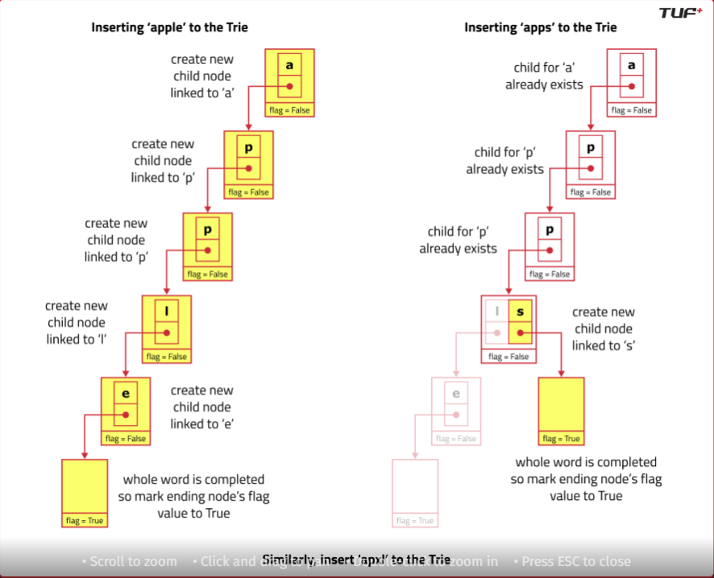

# Tries DS
### What is Tries and where this DS can be used
Ans: If there is scenario where we need to check if some string exists in the given string
or insert some character in string or is we have string starts with some specific string. There we use tries.

i.e we have strings apple, apps, apxl, bac, bat. if we need to check if we have apple in our string we can do it with Tries 

In tries DS we have a class: 
~~~java
class TriesNode {
    TriesNode[] tries = new TriesNode[26];
    boolean flag;
}
~~~

So we will have a class Tries that will have self reference of 26 arrays, which will be denoted as:
`0 -> a,
1 -> b
2 -> c
.....
25 -> z`

### Insertions: 
When we insert any string in tries we goes character by character, for each character we will create a new TriesNode
we will check if we have reference node for the character, if no, then create a reference node at that position and 
assign that for that position.
If yes, then simply leave the current character an check for next character

