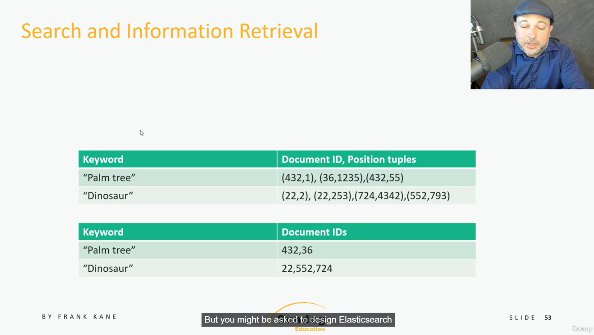
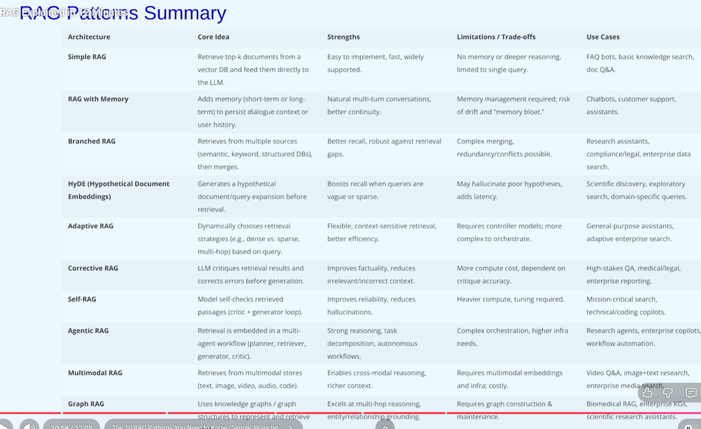
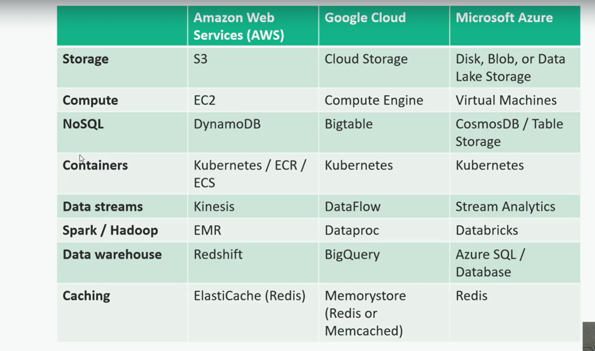

# Different ways to retrieve/store data in DB

***
## Text Search
If we have a system where we need to find if a specific text is present in

As in the image we can see if we have text "palm tree" and it preset in multiple files, then we can create a table that
will have key as the text and value will be a tuple/entry where its key is the document id and value is the postion

And we also have another table which will keep word -> documents ids entry
if a word is present in multiple documents then it will be list of document ids

***
## Cloud Services

